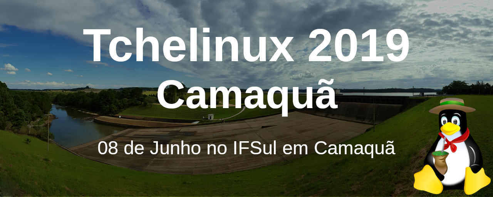

## Sobre

O grupo de usuários de Software Livre Tchelinux, em parceria com o [Instituto Federal de Educação, Ciência e Tecnologia Sul-rio-grandense Campus Camaquã](http://www.camaqua.ifsul.edu.br/), tem o prazer de convidar a comunidade para participar do evento que ocorrerá no dia **8 de Junho de 2019 a partir das 8:30h** no IFSul em Camaquã.

## Inscrições

 O evento tem **entrada franca**, porém os participantes são encorajados a doar 2kg de alimentos não perecíveis (exceto sal), que são doados a instituições de caridade da região. Os alimentos são recebidos no momento do credenciamento.

<a href="https://forms.gle/PASmvCq2T2V59kok8" target="_blank"><b>Clique aqui para fazer sua inscrição!</b></a>

## Certificados

Serão fornecidos certificados digitais para os participantes do evento, que confirmaram sua presença. Para obtê-los, você deverá utilizar o email fornecido na sua inscrição para o evento.

**Importante:** Não esqueça de confirmar sua presença no credenciamento.

## Programação

| 
 Horário 
 | 
 Sala 1   Desenvolvimento I 
 | 
 Sala 2   Desenvolvimento II  
 | 
 Sala 3   DevOps e Comunidade 
 |
|:--------------------------:|:-----------------------:|:-----------------------:|:-----------------------:|
| **08:30** <td colspan=4>
**Credenciamento**
 |
| **09:00** <td colspan=4>
**Abertura**  Todo o público  Equipe Tchelinux  
 |
| **09:30** <td colspan=4>
[**Que é Software Livre e o que ele pode fazer por você?**](#Que_é_Software_Livre_e_o_que_ele_pode_fazer_por_você?)  Principiante  Equipe Tchelinux  
 |
| **10:30** <td colspan=4>
[**Porque e Como Participar de Projetos Open Source**](#Porque_e_Como_Participar_de_Projetos_Open_Source)  Principiante  Julio Biason  
 |
| **11:30** <td colspan=4>
**Intervalo para Almoço**
 |
| **13:30** | [**Desenvolvendo jogos com Python e pygame**](#Desenvolvendo_jogos_com_Python_e_pygame)   Principiante   Rafael Jeffman | [**Web Developer Starter Pack: Tudo o que você precisa saber para começar a trabalhar com desenvolvimento web**](#Web_Developer_Starter_Pack:_Tudo_o_que_você_precisa_saber_para_começar_a_trabalhar_com_desenvolvimento_web)    Principiante   José Carlo de Camargo | [**Testes de Software**](#Testes_de_Software)   Intermediário   Robson Tietz de Oliveira |
| **14:20** | [**Sistema de compartilhamento de planos de ensino **](#Sistema_de_compartilhamento_de_planos_de_ensino)   Intermediário   Geordano Luis Figueira de Lima | [**Rock And Code: Como criar música programando**](#Rock_And_Code:_Como_criar_música_programando)   Principiante   Jerônimo Medina Madruga | [**Principais motivos pelos quais você precisa ter um backup do seu ambiente**](#Principais_motivos_pelos_quais_você_precisa_ter_um_backup_do_seu_ambiente)   Principiante   Bruna Grellt |
| **15:10** <td colspan=4>
**Coffee-Break**
 |
| **15:40** | [**Introdução a Inteligência Artificial: Deep Learning com Python e TensorFlow**](#Introdução_a_Inteligência_Artificial:_Deep_Learning_com_Python_e_TensorFlow)   Intermediário   Inácio Mattos | [**Porque Você Deve Aprender Rust **](#Porque_Você_Deve_Aprender_Rust)   Principiante   Julio Biason | [**Docker para desenvolvedores **](#Docker_para_desenvolvedores)   Principiante   Lucas Lehnen |
| **16:30** | [**Introdução a Vue.js **](#Introdução_a_Vue.js)   Principiante   João Pedro Sabbado Pereira | [**Flutter, o Mobile UI Framework da Google**](#Flutter,_o_Mobile_UI_Framework_da_Google)   Principiante   Guilherme Severo | [**Maneiras fantásticas de tornar sua organização pessoal mais refrescante do que meias limpas!**](#Maneiras_fantásticas_de_tornar_sua_organização_pessoal_mais_refrescante_do_que_meias_limpas!)   Principiante   Júlio César Medina Madruga |
| **17:20** <td colspan=4>
**Encerramento**  Todo o público     Equipe Tchelinux    
 |

## Palestras

### Que é Software Livre e o que ele pode fazer por você?

O Software Livre está em todo o lugar: além de viabilizar a Internet e a cloud, ele está no celular e tablets no bolso de bilhões de seres humanos, em dispositivos embarcados, computadores, servidores e em praticamente todos os supercomputadores usados em pesquisas para o avanço da ciência. Nesta apresentação serão vistos brevemente conceitos importantes sobre o Software Livre e como ele pode te ajudar na tua jornada profissional.

### Equipe Tchelinux

Re-fundado por amigos em 2006, o [Tchelinux](https://tchelinux.org/) é um dos maiores grupos de usuários de Software Livre do mundo em [número de membros e atividades](https://wiki.tchelinux.org/#!eventos/historico_eventos.md), tem como principal objetivo levar o conhecimento à estudantes e demais interessados através da organização de eventos gratuitos e promover a caridade. Saiba um pouco mais sobre nossa história em [nosso website](https://wiki.tchelinux.org/#!sobre.md) e [junte-se a nós](https://wiki.tchelinux.org/#!como_participar.md)!

### Porque e Como Participar de Projetos Open Source

No mundo atual, todos usam pelo menos um aplicativo open source. Mas como participar disso? Como ajudar o aplicativo a melhorar? É preciso saber programar para ajudar? Essas e outras perguntas serão respondidas nessa apresentação.

### Julio Biason

[Julio Biason](https://functional.cafe/@juliobiason) participa de projetos open source desde 1990.

### Desenvolvendo jogos com Python e pygame 

Jogar todo mundo joga. Programar, todo mundo pode. Jogar todo mundo treina. Programar, nem tanto. Mas para jogar é necessário que alguém desenvolva suas habilidades de programador. Nesse bate papo, porque ninguém mais tem paciência para palestras, será apresentada uma forma divertida de desenvolver a programação e conhecer a linguagem Python, construindo jogos, utilizando a biblioteca Pygame e ferramentas open source para desenvolver um jogo.

### Rafael Jeffman

[Rafael Guterres Jeffman](https://github.com/rafasgj) é fotógrafo, impressor e professor universitário. Leciona as disciplinas de algoritmos, estruturas de dados e desenvolvimento de jogos. Colaborou por anos com a distribuição GoboLinux. Entre seu projetos atuais, está um sistema de gerenciamento de ativos digitais multiplataforma, open source.

### Web Developer Starter Pack: Tudo o que você precisa saber para começar a trabalhar com desenvolvimento web

Palestra voltada para o público que tem interesse em conhecer e talvez trabalhar com desenvolvimento web mas ainda não sabe por onde começar.

### José Carlo de Camargo

[José Carlo de Camargo](https://jccamargo.me/) Desenvolvedor Full Stack com 5 anos de experiência.

### Testes de Software

Geral sobre teste de software, definições, exemplos de testes, ferramentas, etc.

### Robson Tietz de Oliveira

[Robson Tietz de Oliveira](https://www.facebook.com/robson.crow) é MBA em Qualidade de Software, Bacharel em Tecnologia em Processamento de Dados, Analista de Testes do grupo Lins Ferrão, empresas anteriores: CWI Software, Sicred, Humanus e Avacon.

###  Introdução a Inteligência Artificial: Deep Learning com Python e TensorFlow

É uma palestra com objetivo de exibir como funciona o tão comentado assunto que é Inteligência Artificial atualmente. Começando introduzindo IA de forma geral, passando em como um computador é 'capaz' de aprender e finalizando em como programar um programa que identifique números escritos a mão com Python e TensorFlow.

### Inácio Mattos

[Inácio Mattos](https://github.com/inacioMattos) tem 19 anos é técnico em informática e atualmente estudo. Já trabalhou no Grupo Lins Ferrão na área de Sistemas e Desenvolvimento, programando soluções em Python e JS e já apresentou alguns workshops sobre malwares, robótica e desenvolvimento de jogos.

### Rock And Code: Como criar música programando 

A maioria dos métodos para aprender programação envolvem operações matemáticas e lógicas, o que não é muito atraente para muita gente, afinal nem todos acham incrível quando finalmente conseguem fazer um merge sorte ou uma árvore binária... Então, que tal tentar algo diferente, como juntar música e programação? Nessa palestra será apresentado Sonic Pi, um sintetizador digital que permite que as pessoas criem música como se estivessem programando! A ideia é mostrar como instalar e configurar a ferramenta, e por fim fazer um pouco de rock & roll com código!

### Jerônimo Medina Madruga

[Jerônimo Medina Madruga](https://www.linkedin.com/in/jmmadruga/) trabalha com suporte técnico e treinamento para educação a distância da Universidade Federal de Pelotas (UFPel). Tem formação em Técnico em Eletrônica pelo Instituto Federal Sul-Rio-Grandense (IFSUL) e é ocasionalmente atuante em grupos ligados a divulgação e desenvolvimento de software livre. Já realizou mais de 70 palestras em eventos internacionais, nacionais e regionais, sobre os temas mais variados possíveis, normalmente ligados a educação, programação, comunidades, CMS e administração de sistemas.

### Principais motivos pelos quais você precisa ter um backup do seu ambiente 

Nesta palestra vou apontar os 2 principais motivos pelo qual você precisa ter uma cópia de segurança dos seus dados, as ferramentas de mercado que podem te ajudar nesta estratégia e algumas dicas. 

### Bruna Grellt

[Bruna Grellt](https://www.linkedin.com/in/brunagrellt/) é Customer Success na Adentro Cloud Solutions, empresa de Data Center, na qual está auxiliando o desenvolvimento da Cultura de Sucesso do Cliente em conjunto com a reestruturação de atendimento da equipe de Suporte e Comercial.

### Sistema de compartilhamento de planos de ensino 

Será apresentado uma API desenvolvida em Python, utilizando framework Django REST, também será apresentado um front-end consumindo esta API, desenvolvido na linguagem JavaScript, com o uso do framework Vue. O desenvolvimento deste sistema, se deu ao decorrer do curso Tecnólogo em Análise e Desenvolvimento de Sistemas da instituição, IFSUL camaquã, onde foi apresentado como trabalho de conclusão de curso. O sistema tem como objetivo, auxiliar os professores e instituições, a compartilhar suas ideias, e metodologias aplicadas em sala de aula, apresentando os pontos positivos e negativos de cada aula, para que os professores possam trocar experiencias.

### Geordano Luis Figueira de Lima

[Geordano Luis Figueira de Lima](https://github.com/geordanolima/) é Formado em Técnico em Informática pelo CEM Pastor Dohms (2010), formado em Técnico em Manutenção e Suporte em Informática pelo IFSul Camaquã (2014), Formado em Análise e Desenvolvimento de Sistemas pelo IFSul Camaquã (2018) e Programador no Grupo Lins Ferrão, desde 2016.

### Porque Você Deve Aprender Rust 

Rust (a linguagem, não o jogo) é uma linguagem que produz código em que a memória é protegida. Trazendo muitas das funcionalidades de linguagens funcionais, com abstrações de alto nível e performance semelhante a C, Rust é uma linguagem que você realmente deve aprender.

### Julio Biason

[Julio Biason](https://functional.cafe/@juliobiason) é programador desde os 12 anos e já conheceu várias linguagens, mas nenhuma que fosse tão interessante quanto Rust.

### Docker para desenvolvedores 

Será apresentado a tecnologia de containers utilizando Docker e Docker Swarm. A palestra focará no básico dos elementos do Docker e serão exibidos exemplos de deploy de aplicações de diversas linguagens

### Lucas Lehnen

[Lucas Lehnen](https://www.linkedin.com/in/lucas-lehnen/) é Graduado em Análise e Desenvolvimento de Sistemas e Coordenador de Sistemas nas Lojas Pompeia.

### Introdução a Vue.js 

Tem por objetivo construir o ambiente para o desenvolvimento, utilizando o Framework Vue.js, ilustrando de forma prática, as suas principais estruturas conforme o [manual oficial](https://vuejs.org/v2/guide/). Também oferecendo um panorama geral dos framework's e bibliotecas reativas de javascript que atualmente sustentam este mercado (Angular, React e Vue), em conjunto com a base teórica necessária sobre o funcionamento destas tecnologias.

### João Pedro Sabbado Pereira

[João Pedro Sabbado Pereira](https://www.linkedin.com/in/jo%C3%A3o-pedro-sabbado-pereira-a41508128/) é Desenvolvedor Trainee do Grupo Lins Ferrão (Lojas Pompeia). Cursando o ultimo semestre do curso Analise e Desenvolvimento de Sistemas oferecido pelo IFSUL Camaquã.

### Flutter, o Mobile UI Framework da Google 

Será uma apresentação ao Flutter: Framework mobile multiplataforma desenvolvido pela Google. Será abordado conceitos da linguagem Dart, também desenvolvida pela Google, que promete ser uma linguagem escalável e muito robusta para desenvolvimento web e mobile(principal linguagem de criação de aplicativos para o Google Fuchsia). Mostrarei também, como o Flutter pode e vai ajudar o programador a criar aplicativos nativos muito bonitos e em tempo record, as principais vantagens em relação as outras ferramentas do mercado e o conceito de Hot Reloading diretamente no celular.

### Guilherme Severo

[Guilherme Severo](https://www.linkedin.com/in/guilherme-severo-30092913b/) é Programador de Sistemas nas Lojas Pompéia.

### Maneiras fantásticas de tornar sua organização pessoal mais refrescante do que meias limpas! 

Você sabia que 80% dos problemas não conseguimos resolver, e são resultado de organizarmos quando muito, 20% de nosso dia-a-dia? Aprenda a organizar sua vida com metodologias e apps, e encontre tempo para fazer também o que gosta!

### Júlio César Medina Madruga

[Júlio César Medina Madruga](https://www.facebook.com/seujulio) é Cantor, TAE de T.I., entusiasta de sustentabilidade, PNL e coaching. Júlio César Madruga trabalha no Núcleo de Tecnologia de Informação da Universidade Federal do Rio Grande – FURG. Um bagunceiro no limiar entre a Informação e a Comunicação, fazendo papel de advogado do diabo dos aplicativos onipresentes de anotação em prol da organização pessoal.

## Local

> **IFSul Campus Camaquã**
> Rua Ana Gonçalves da Silva, 901
> Bairro Olaria 
> Camaquã - RS

	<iframe src="https://www.google.com/maps/embed?pb=!1m18!1m12!1m3!1d4843.356244967036!2d-51.80355429499433!3d-30.865112570836118!2m3!1f0!2f0!3f0!3m2!1i1024!2i768!4f13.1!3m3!1m2!1s0x951a76f76d4cfa15%3A0x27091c7e40085d63!2sIFSul+Campus+Camaqua!5e0!3m2!1sen!2sbr!4v1556637336678!5m2!1sen!2sbr" width="600" height="450" frameborder="0" style="border:0" allowfullscreen></iframe>

## Apoio

### Institucional

### Patrocínio

### Divulgação

